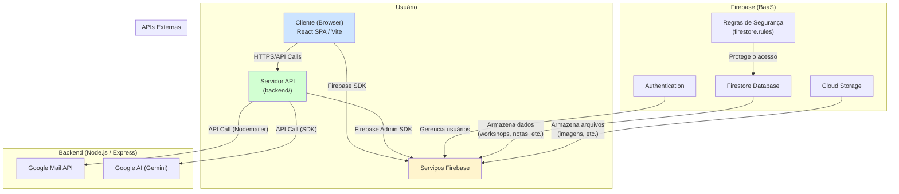

# Documentação Técnica: Lean Inception App

## 1. Resumo

Este documento oferece uma análise técnica exaustiva da "Lean Inception App". Ele é destinado a desenvolvedores, arquitetos e partes interessadas técnicas, fornecendo um mergulho profundo na arquitetura do sistema, decisões tecnológicas, padrões de design, protocolos de segurança e fluxos de dados.

A aplicação é uma plataforma colaborativa projetada para facilitar workshops de Lean Inception. Ela é construída sobre uma arquitetura moderna e desacoplada, compreendendo um frontend reativo em **React (com TypeScript)** e um backend de serviços em **Node.js (com TypeScript)**, com o **Firebase** atuando como a espinha dorsal para dados em tempo real, autenticação e armazenamento de arquivos.

---

## 2. Detalhes da Arquitetura

A arquitetura foi projetada com base em quatro pilares principais:

1.  **Separação de Responsabilidades (SoC):** O frontend é puramente responsável pela apresentação e experiência do usuário. O backend gerencia a lógica de negócios pesada, integrações de terceiros e tarefas seguras. O Firebase atua como um Backend-as-a-Service (BaaS) para dados, autenticação e colaboração em tempo real.
2.  **Escalabilidade:** A arquitetura desacoplada permite que o frontend, o backend e os serviços do Firebase escalem de forma independente. O backend Node.js, sendo sem estado (stateless), pode ser facilmente replicado para lidar com aumento de carga.
3.  **Segurança em Camadas (Defense in Depth):** A segurança é implementada em várias camadas: no cliente (validação de entrada), no backend (autenticação de token JWT e validação de permissões) e diretamente no banco de dados através das Regras de Segurança do Firestore.
4.  **Real-Time First:** A colaboração em tempo real é um requisito central. A escolha do Firestore e o padrão de design da aplicação refletem essa prioridade, utilizando listeners `onSnapshot` para atualizações instantâneas da UI sem a necessidade de polling.

### Diagrama da Arquitetura

O diagrama abaixo ilustra a interação entre os componentes do sistema:



---

## 3. Detalhamento das Tecnologias

### 3.1. Frontend (Client-Side)

*   **Core:** React 18, TypeScript, Vite
*   **Roteamento:** React Router DOM v6
*   **Estilização:** Tailwind CSS com PostCSS
*   **Componentes de UI:** shadcn/ui, Radix UI
*   **Comunicação com Backend:** Fetch API nativa
*   **Comunicação com Firebase:** `firebase/app`, `firebase/auth`, `firebase/firestore`
*   **Renderização de Markdown:** `react-markdown` com `remark-gfm`
*   **Manipulação de Data/Hora:** `date-fns`

### 3.2. Backend (Server-Side)

*   **Core:** Node.js, Express, TypeScript
*   **Comunicação com Firebase:** `firebase-admin` (Admin SDK)
*   **Autenticação:** `jsonwebtoken` para validação de tokens JWT
*   **Envio de E-mail:** `nodemailer`
*   **Integração com IA:** `@google/generative-ai`
*   **Variáveis de Ambiente:** `dotenv`
*   **Desenvolvimento:** `concurrently` e `nodemon` para hot-reloading simultâneo de frontend e backend.

### 3.3. Firebase (BaaS)

*   **Firestore:** Banco de dados NoSQL utilizado para todos os dados da aplicação. Sua capacidade de real-time é o motor da colaboração.
*   **Authentication:** Gerencia o ciclo de vida dos usuários (registro, login, verificação de e-mail).
*   **Cloud Storage:** Usado para armazenar assets gerados ou enviados por usuários, como imagens de perfil ou de workshops.

---

## 4. Estrutura de Arquivos do Projeto (`src`)

A organização dos arquivos segue uma abordagem modular e baseada em funcionalidades para facilitar a manutenção e a escalabilidade.

*   **`src/components/`**: Coração da UI, dividido em:
    *   **`ui/`**: Componentes de base, agnósticos da lógica de negócio (ex: `Button.tsx`, `Card.tsx`).
    *   **`templates/`**: Componentes que implementam as atividades da Lean Inception (ex: `PersonasTemplate.tsx`, `MVPCanvasTemplate.tsx`).
    *   **Raiz (`./`)**: Componentes complexos que orquestram a aplicação (ex: `WorkspaceSelector.tsx`, `WorkshopCanvas.tsx`).

*   **`src/hooks/`**: Hooks React customizados para encapsular lógica reutilizável (ex: `useAuth`, `useToast`).

*   **`src/integrations/`**: Módulos que configuram a conexão com serviços externos.
    *   `firebase/client.ts`: Inicializa o SDK do Firebase para o cliente.
    *   `firebase/server.ts`: Inicializa o SDK Admin do Firebase para o backend.

*   **`src/lib/`**: Funções utilitárias, constantes e definições de tipo que são compartilhadas por toda a aplicação (ex: `utils.ts`, `defaultTemplates.ts`).

*   **`src/pages/`**: Componentes que representam páginas completas e são mapeados para as rotas do React Router (ex: `Auth.tsx`, `Admin.tsx`).

*   **`backend/`**: Código-fonte do servidor Node.js/Express, contendo a API, middlewares e integrações.

---

## 5. Modelo de Colaboração em Tempo Real

A colaboração em tempo real é a funcionalidade mais crítica da aplicação. Ela é alcançada através de uma combinação do SDK do Firebase e das Regras de Segurança do Firestore.

1.  **Inscrição (Subscription):** Quando um usuário entra em um workshop, o frontend (React) se inscreve em coleções específicas do Firestore usando o método `onSnapshot`.
    *   Por exemplo, para ver os sticky notes, o componente `WorkshopCanvas` se inscreve na subcoleção `workshops/{workshopId}/stickyNotes`.

2.  **Ação do Usuário:** Um usuário realiza uma ação que modifica o estado, como criar, mover ou editar um sticky note.

3.  **Escrita no Firestore:** O frontend chama uma função do SDK do Firebase (`addDoc`, `updateDoc` ou `deleteDoc`) para aplicar a alteração diretamente no banco de dados.

4.  **Validação de Segurança:** Antes de confirmar a escrita, o Firestore avalia as **Regras de Segurança** (`firestore.rules`). A regra verifica se o `request.auth.uid` (o ID do usuário que fez a requisição) pertence aos membros do workspace associado ao workshop. Se a condição não for atendida, a operação falha.

5.  **Distribuição (Fan-out):** Se a escrita for bem-sucedida, o Firestore propaga a alteração para **todos os clientes** que estão atualmente inscritos (`onSnapshot`) naquela coleção ou documento.

6.  **Atualização da UI:** O listener `onSnapshot` de cada cliente é acionado com os novos dados. O React detecta a mudança no estado e re-renderiza eficientemente a interface para refletir a alteração, garantindo que todos os participantes vejam a mesma coisa em tempo real.

Este modelo é altamente eficiente, pois elimina a necessidade de o cliente fazer polling do servidor. A comunicação é reativa e orientada a eventos.

---

## 6. Análise de Segurança

*   **Autenticação:** O fluxo de autenticação é gerenciado pelo Firebase Authentication. Após o login, o cliente recebe um **JSON Web Token (JWT)**, que é enviado no cabeçalho `Authorization` de todas as requisições para o nosso backend.

*   **Autorização no Backend:** Um middleware no servidor Express intercepta cada requisição. Ele usa o Firebase Admin SDK para verificar a validade do token JWT. Se o token for válido, o `uid` do usuário é extraído e anexado ao objeto da requisição, tornando-o disponível para as rotas subsequentes. Rotas protegidas verificam este `uid` para confirmar permissões.

*   **Autorização no Banco de Dados (Firestore Rules):** Esta é a camada de segurança mais importante. As regras em `firestore.rules` são a fonte final da verdade para o controle de acesso. Elas garantem que, mesmo que um cliente mal-intencionado tente contornar a lógica do frontend ou do backend, ele não possa ler ou escrever dados aos quais não tem permissão. 
    *   **Exemplo de Regra:**
        ```
        match /workshops/{workshopId} {
          // Permite leitura se o usuário for membro do workspace
          allow read: if get(/databases/$(database)/documents/workspaces/$(resource.data.workspace_id)).data.members[request.auth.uid] != null;

          // Permite escrita se o usuário for membro com função de admin ou editor
          allow write: if get(/databases/$(database)/documents/workspaces/$(resource.data.workspace_id)).data.members[request.auth.uid] in ['admin', 'editor'];
        }
        ```

---

## 7. Principais Endpoints da API Backend (`/api`)

O backend expõe uma API RESTful para operações que não podem ser executadas com segurança no cliente.

*   **`POST /api/invite`**: Envia um e-mail de convite para um usuário se juntar a um workspace. Protegido por autenticação e verificação de permissão de administrador.
*   **`POST /api/ai`**: Rota para interagir com o AI Assistant. O frontend envia a mensagem e o histórico, e o backend repassa a consulta para a API do Google AI, usando a chave de API armazenada de forma segura.
*   **`POST /api/set-admin`**: Endpoint administrativo para promover um usuário à função de administrador. Protegido para ser executado apenas por administradores existentes.
*   **`GET /api/report/:workshopId`**: Endpoint (exemplo, se a geração for no backend) que poderia gerar um relatório PDF de um workshop consolidando os dados do Firestore.

